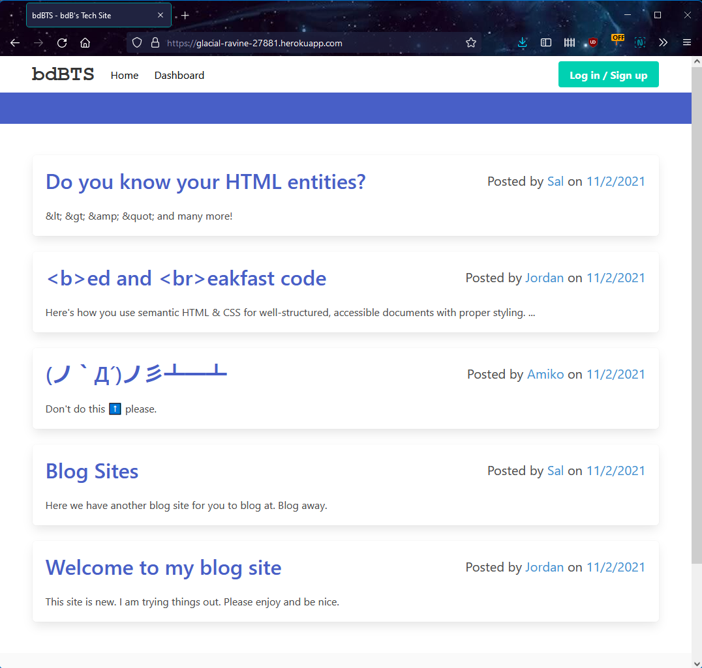
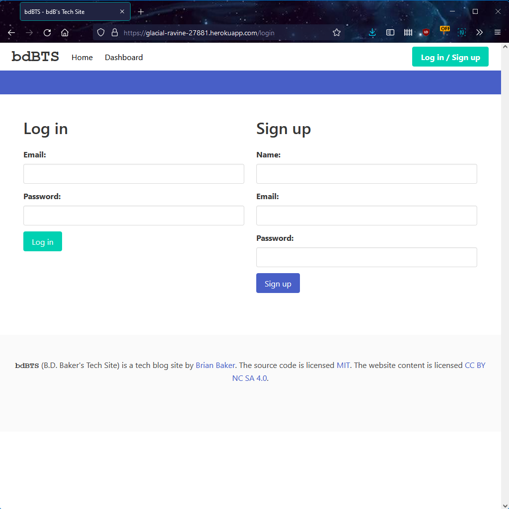
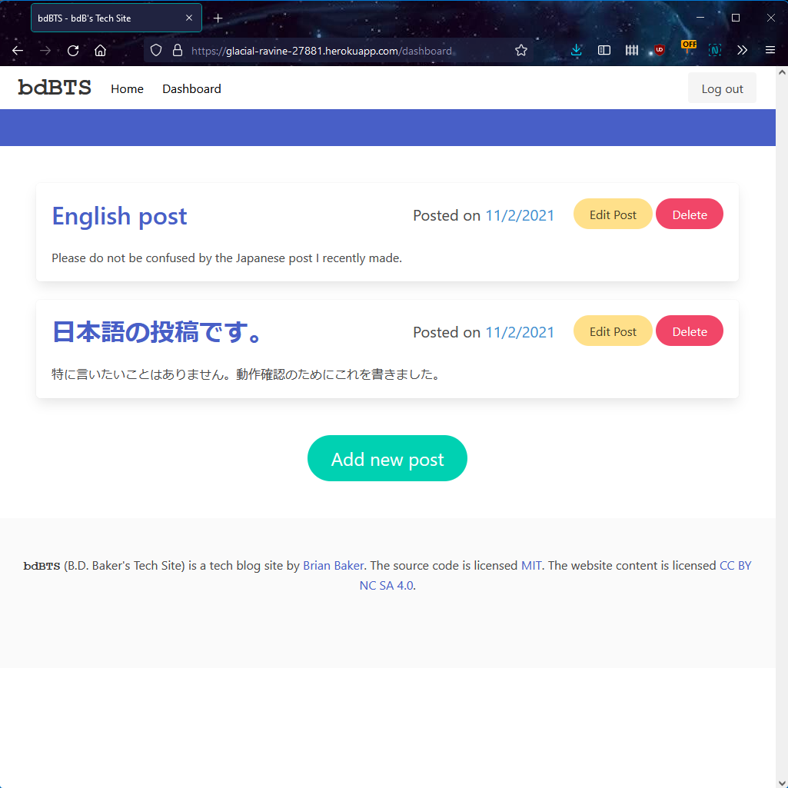

# bdBTS [](https://opensource.org/licenses/MIT)

## Description

An online tech blog implemented in node.js with MySQL and Handlebars

## Contents

- [Installation](#installation)
- [Usage](#usage)
- [Questions](#questions)
- [License](#license)

## Installation

To run this app on your local machine, you will need to run the following at the console.

```
git clone https://github.com/baker-ling/bdBTS
npm install
```

Next, you will need to resave the file `.env.EXAMPLE` as `.env` and type in values for `DB_PASSWORD` and `DB_USER` based on the configuration for your database.

Optionally, you can run `node seeds/seed.js` to populate the database with some initial data.

## Usage

Type `node server` at the console to launch the webserver on localhost. It will run on port 3001 by default.

### Deployed Instance 
A version of the app is currently up and running [here](https://glacial-ravine-27881.herokuapp.com/).

### Features

You can view posts without being logged in. Click on any post title to bring up a post and its comments.



You must log in or sign up for account in order to add posts or comments of your own.



After you logged in, you can add comments.


You can also go to the dashboard to add, edit, or delete posts.



One warning about the dashboard: the delete button will not ask for confirmation. Be careful!

Finally, when you are done posting content, you can log out by clicking the "Log out" button in the nav bar. If you don't log out, you will stay logged in for 24 hours from when you logged in.


## Questions

If you have any questions, feel free to reach out via one of the following:

- Email: [brian.baker.bdb@gmail.com](mailto:brian.baker.bdb@gmail.com)
- Github: @baker-ling

## License

This application is distributed under the terms of [MIT License](./LICENSE).
